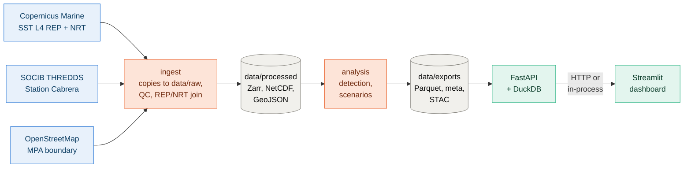

# Architecture

## Processing chain

The code mirrors the data: each stage of the chain is a subpackage, and each writes to its own layer of `data/`.

| Stage | Code | Reads | Writes |
|---|---|---|---|
| Ingestion | `ingest/sst.py`, `ingest/insitu.py`, `ingest/mpa.py` | the providers | `data/raw`, `data/processed` |
| Analysis | `analysis/mhw.py`, `analysis/whatif.py`, `analysis/indicators.py` | `data/processed` | nothing: returns an `Indicators` object |
| Export | `export/tables.py`, `export/stac.py` | an `Indicators` object | `data/exports` |
| Build | `pipeline.py` | | chains analysis and export |
| Service | `api.py` | `data/exports` | HTTP answers |
| Interface | `dashboard/` | the API | pages |

Keeping `analysis/` free of file access makes the science testable on synthetic series, and lets the same functions run inside the API: `/scenario` calls the same detection as the build.

## Design choices

### Three data layers

`raw/` keeps exactly what each provider returned. When the result of a step looks wrong, the question "was it the source or the processing?" has an answer on disk, and the in-situ exclusion rule (see [Method](method.md#in-situ-quality-control)) can be justified from the original files. It is split by provider because each has its own licence and refresh cycle, and can be fetched again on its own.

`processed/` holds one harmonised product per source, in the format its shape calls for. `exports/` holds what the services read. Only `raw/` is left out of git: `processed/` and `exports/` are small (about 3 MB) and committed, so everything downstream of the download runs without credentials, in the CI too.

### Zarr for the satellite cube

The satellite series is a (time, latitude, longitude) cube that grows by one day at a time. A NetCDF file has to be rewritten to grow; a Zarr store is a directory of compressed chunks, so `make update` writes only the chunk that receives the new days. Zarr is also the format of the Copernicus Marine ARCO datasets and of the EDITO data lake, so the store can move to object storage unchanged.

The store is Zarr version 3 without consolidated metadata: consolidation is not part of the version 3 specification, and with a dozen local files it saves nothing. Served from object storage, a Zarr version 2 store with consolidated metadata, the layout of the ARCO datasets, would save a request per variable.

The in-situ series stays a CF NetCDF file: three depths over about a year, 20 KB, rewritten in full at each fetch.

### Parquet and DuckDB for the indicators

Indicators are tables (per day, per year and scenario, per event, per pixel), so they are stored as columnar Parquet files and queried with DuckDB, which reads Parquet in place. The API passes its query parameters to SQL (filter, sort, limit) instead of loading whole files, and any analyst can open the same tables in pandas, R or DuckDB.

Provenance and status (sources, method parameters, current event, exclusions) are a small nested document, not a table: they stay JSON, in `meta.json`.

### One set of queries for the API and the dashboard

The API routes are declared with `Annotated` parameters, so each route is also an ordinary Python function with working defaults. The dashboard has a single data function, `fetch(route, **params)`: it sends an HTTP request when `CABRERA_API_URL` is set, and otherwise calls the route function directly. The dashboard therefore never reads a file itself, the numbers it shows are exactly what a partner service would get from the API, and it still runs as a single process on a small host.

### Precomputed and on-demand scenarios

The build precomputes four warmings (+0.5, +1, +1.5 and +2 °C) for every pixel, which the map needs and which would be slow to compute per request. The `/scenario` route recomputes the MPA-mean detection for any warming and any window in a few milliseconds. A test checks that both give the same counts.

## Deployment

One Docker image carries the package, the dashboard and the exports; it starts the API by default and the dashboard with another command. `compose.yaml` runs both, the dashboard reading the API over HTTP. On a single-container host such as a Hugging Face Space, the dashboard runs alone and calls the API functions in-process.

## How it maps to a Digital Twin of the Ocean

| DTO function | Here |
|---|---|
| Ingest and harmonise heterogeneous data | Satellite L4 SST, in-situ moorings and a vector boundary on a common daily grid |
| Scientific processing | Climatology, percentile threshold, event detection, per-pixel indicators |
| Validation | Satellite against in situ at three depths |
| What-if scenarios | Any uniform warming, on the MPA mean and per pixel |
| Services | FastAPI over the exports, consumed by the dashboard |
| Containers and deployment | One image, two entry points, Compose |
| Visualisation | Maps, time series, yearly indicators, event tables |
| Interoperability, FAIR | Zarr, CF NetCDF, Parquet, STAC catalog, provenance in `meta.json` |
| Operational updates | `make update` appends the new days and rebuilds |
| Reproducibility | Pinned environment, tests, check against the reference implementation, byte-identical rebuilds |
