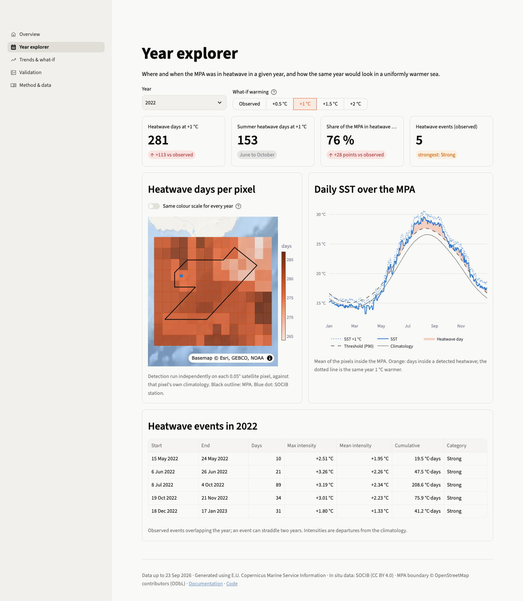
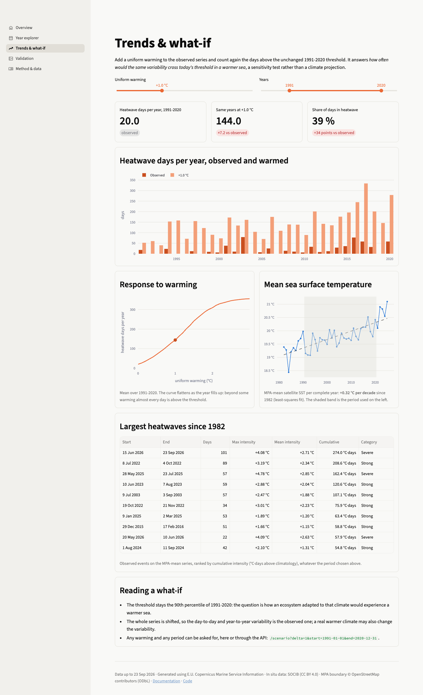
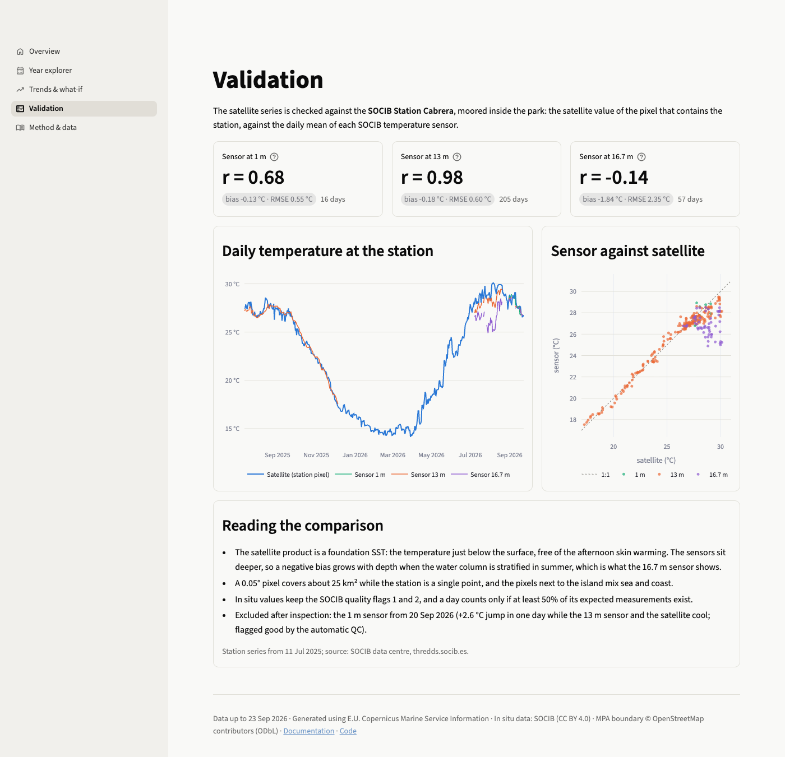
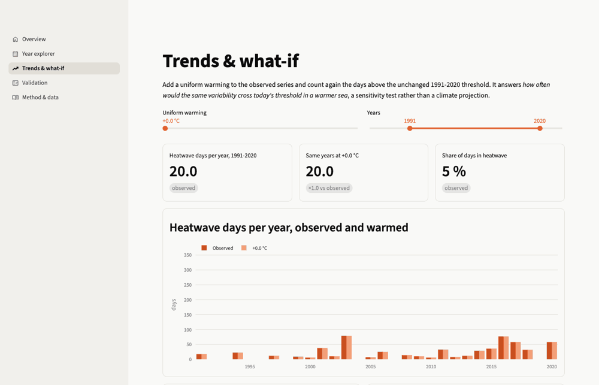

# Dashboard

A Streamlit application in `dashboard/`, run with `make dashboard` (http://localhost:8501).

## Pages

=== "Overview"

    

=== "Year explorer"

    

=== "Trends & what-if"

    

=== "Validation"

    

Moving the warming slider from 0 to 3 °C on the Trends & what-if page:




| Page | Content |
|---|---|
| **Overview** | The ongoing heatwave and the sea surface today, each with a small chart; heatwave days per year in the first and the last complete decade and the record year; heatwave days per year since 1982 (click a year to open it in the Year explorer); the park and its satellite pixels on a map; what a marine heatwave is |
| **Year explorer** | For a year and a precomputed warming: four figures, the map of heatwave days per pixel (scale per year or fixed across years), the daily SST with its climatology, threshold and heatwave days, and the events of the year |
| **Trends & what-if** | Any warming from 0 to 3 °C and any period: heatwave days per year observed and warmed, the response of heatwave days to warming, the SST trend, the largest heatwaves on record |
| **Validation** | Statistics per sensor, the daily station and satellite series, sensor against satellite with the 1:1 line, and how to read the comparison |
| **Method & data** | Processing chain, sources and terms, detection parameters, the monthly REP/NRT correction, how to reuse the outputs, limits |

The year, the warming and the period are kept in the URL, so a link reopens the same view, for example `/year_explorer?year=2003&delta=1`.

## Data access

`dashboard/common.py` holds the only data function, `fetch(route, **params)`: it calls the API over HTTP when the environment variable `CABRERA_API_URL` is set, and otherwise calls the route function of `cabrera_twin.api` directly. Answers are cached for ten minutes. The pages never open a file.

| Mode | Set up | Use |
|---|---|---|
| In-process | default | Local work, single-container hosting |
| HTTP | `CABRERA_API_URL=http://host:8000` | Dashboard and API as separate services (`make up`) |

## Structure

```text
dashboard/
  streamlit_app.py   page setup and navigation
  common.py          fetch, colours, chart and map helpers, shared tables
  overview.py
  year_explorer.py
  trends.py
  validation.py
  method.py
.streamlit/config.toml   theme
```

Charts and maps use Plotly. Maps draw the Esri Ocean basemap as raster tiles, which need no key. The theme uses Streamlit's bundled sans-serif font, so the dashboard renders the same offline.

## Tests

`tests/test_dashboard.py` runs each page with Streamlit's `AppTest`, headless, and checks that it renders without exception and shows the expected figures.
