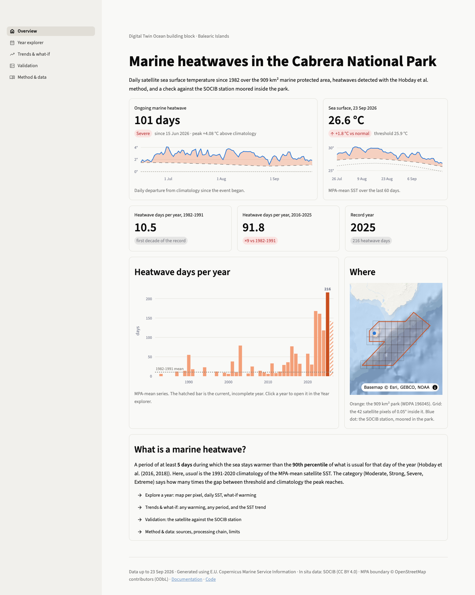
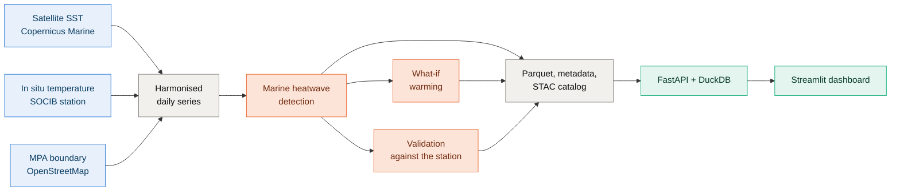

# Marine heatwaves in the Cabrera National Park

A small component of a Digital Twin of the Ocean for the Cabrera Archipelago National Park (Balearic Islands, 909 km²): satellite and in-situ ocean data in, reproducible marine heatwave indicators out, served through an HTTP API and an interactive dashboard.

[Get started](getting-started.md){ .md-button .md-button--primary } [Read the method](method.md){ .md-button } [Source code](https://github.com/pstcricq/cabrera-mhw-twin){ .md-button }

This site is the technical guide: how the project is built, what each dataset contains, how the indicators are computed and why the method looks the way it does. To install and run the project quickly, the [README](https://github.com/pstcricq/cabrera-mhw-twin#readme) is the shorter path.

## Headline figures

Values of the build of 23 September 2026. They change with each update of the data.

-   :material-thermometer-alert:{ .lg .heat } __Heatwave days per year__

    10.5 → 91.8

    First decade of the record (1982-1991) against the last complete decade (2016-2025).

-   :material-trophy-outline:{ .lg .heat } __Record year__

    2025

    216 heatwave days in the park. 87 events since 1982: 61 Moderate, 22 Strong, 4 Severe.

-   :material-chart-bell-curve-cumulative:{ .lg .heat } __What-if, +1 °C__

    20 → 144 days

    Heatwave days per year over 1991-2020, observed and in a sea 1 °C warmer.

-   :material-trending-up:{ .lg .sea } __Warming trend__

    +0.32 °C / decade

    MPA-mean sea surface temperature since 1982, least-squares fit.

-   :material-check-decagram:{ .lg .sea } __Validation at 13 m__

    r = 0.98

    Satellite against the SOCIB sensor: bias -0.18 °C, RMSE 0.60 °C over 205 days.

-   :material-satellite-variant:{ .lg .sea } __Coverage__

    44 years, daily

    42 satellite pixels of 0.05° inside the park, from 1 January 1982 to yesterday.

## The dashboard

Five pages to explore the indicators: the ongoing heatwave and the long-term change, any year pixel by pixel, any warming scenario, the validation against the station, and the method. More in [Dashboard](dashboard.md).

## What it does

- **Ingestion.** Daily satellite sea surface temperature (SST) since 1982 from Copernicus Marine, reprocessed product extended to today with the near-real-time product; temperature at 1, 13 and 16.7 m from the SOCIB Station Cabrera, moored inside the park; the park boundary from OpenStreetMap.
- **Detection.** Marine heatwaves after Hobday et al. (2016, 2018), on the MPA-mean series and pixel by pixel. The implementation reproduces the reference code event for event.
- **What-if.** Any uniform warming added to the observed series, compared with the unchanged baseline threshold, computed on demand.
- **Validation.** The satellite pixel of the station against each in-situ sensor.
- **Services.** Parquet tables queried in SQL by a FastAPI service, a STAC catalog, provenance in `meta.json`, and a Streamlit dashboard reading the same queries.

## Where to go next

-   :material-rocket-launch-outline:{ .lg .sea } __Getting started__

    Install, download the data, run the API and the dashboard.

    [:octicons-arrow-right-24: Install and run](getting-started.md)

-   :material-sitemap-outline:{ .lg .sea } __Architecture__

    The processing chain, the package layout and the design choices.

    [:octicons-arrow-right-24: How it is built](architecture.md)

-   :material-database-outline:{ .lg .sea } __Data__

    Sources, licences, and the schema of every file produced.

    [:octicons-arrow-right-24: Datasets and schemas](data.md)

-   :material-function-variant:{ .lg .heat } __Method__

    Detection, REP/NRT join, what-if, validation and limits.

    [:octicons-arrow-right-24: The science](method.md)

-   :material-api:{ .lg .heat } __API__

    Routes, parameters and examples in curl, Python and SQL.

    [:octicons-arrow-right-24: Query the indicators](api.md)

-   :material-code-braces:{ .lg .heat } __Code reference__

    Generated from the docstrings of the package.

    [:octicons-arrow-right-24: Modules and functions](reference/index.md)

## Data credits

!!! info "Attribution"

    Generated using E.U. Copernicus Marine Service Information ([10.48670/moi-00173](https://doi.org/10.48670/moi-00173), [10.48670/moi-00172](https://doi.org/10.48670/moi-00172)). In situ data from SOCIB, under CC BY 4.0. MPA boundary © OpenStreetMap contributors, under ODbL. Details in [Data, licences](data.md#licences-and-attribution).
